**Full-Stack & Mobile Developer** &nbsp;·&nbsp; building web, mobile & AI-powered apps

[email](mailto:aswinkumar@duck.com) &nbsp;·&nbsp;
[linkedin](https://linkedin.com/in/aswinkumar7) &nbsp;·&nbsp;
[github](https://github.com/Aswin-Kumar7)

> Full-stack + mobile developer. I ship production-ready apps and learn fast.

I build fast, test on real users, and keep the architecture clean. My core is
full-stack and cross-platform mobile (Flutter & React Native), with a backend
focus on scalable, secure services. Lately I'm leaning into cloud & DevOps —
going deeper on AWS — and I build with AI where it helps: LLMs, RAG, and
real-time pipelines.

<samp>**Languages**&nbsp;&nbsp; typescript &nbsp; javascript &nbsp; python &nbsp; java &nbsp; dart</samp> 
<samp>**Frontend**&nbsp;&nbsp;&nbsp; react &nbsp; next.js &nbsp; tailwind &nbsp; vite</samp> 
<samp>**Mobile**&nbsp;&nbsp;&nbsp;&nbsp;&nbsp; flutter &nbsp; react native</samp> 
<samp>**Backend**&nbsp;&nbsp;&nbsp;&nbsp; node &nbsp; express &nbsp; nestjs &nbsp; fastapi &nbsp; flask &nbsp; graphql</samp> 
<samp>**Data**&nbsp;&nbsp;&nbsp;&nbsp;&nbsp;&nbsp;&nbsp; postgres &nbsp; mongodb &nbsp; redis</samp> 
<samp>**Cloud**&nbsp;&nbsp;&nbsp;&nbsp;&nbsp;&nbsp; aws &nbsp; azure &nbsp; docker &nbsp; gh-actions</samp>

**RoadSOS** &nbsp;·&nbsp; <samp>flutter, ai, on-device ml</samp> 
Emergency roadside-SOS platform for faster incident response. Winner at the IIT
Madras BIMSTEC Hackathon, [recognized by MoRTH, Govt. of India](https://x.com/MORTHIndia/status/2084919840222114297).

**[FactifyAI](https://github.com/Aswin-Kumar7/FactifyAI)** &nbsp;·&nbsp; <samp>python, gemini, manifest v3</samp> 
Fake-news detection for Indian vernacular languages — browser extension, source
validation, and OCR + reverse-image verification. Winner (1st) at the Innovate
and Build Hackathon.

**[Supply-Sense](https://github.com/Aswin-Kumar7/Supply-Sense-Cognizant)** &nbsp;·&nbsp; <samp>react, fastapi, aws bedrock</samp> 
AI platform that helps Indian retailers prevent stockouts — supplier-risk scoring,
shortage forecasts, and mitigations via a LangGraph multi-agent system.

**[AuraAI](https://github.com/Aswin-Kumar7/AuraAI)** &nbsp;·&nbsp; <samp>typescript, fastapi, llm</samp> 
Real-time AI copilot for telecom call-center agents — live transcription,
sentiment, and smart suggestions over WebSockets.

**[traveloop](https://github.com/Aswin-Kumar7/traveloop)** &nbsp;·&nbsp; <samp>typescript</samp> 
End-to-end travel planning — trips, day-wise itineraries, checklists, and a
community to share journeys.

**[transitops](https://github.com/Aswin-Kumar7/transitops)** &nbsp;·&nbsp; <samp>typescript</samp> 
Full-stack transport operations platform for the modern fleet depot.

**[AIRO](https://kasparro-airo.vercel.app/)** &nbsp;·&nbsp; <samp>typescript</samp> 
Makes a Shopify store visible to AI shopping agents before competitors do.

<samp>email</samp> &nbsp; [aswinkumar@duck.com](mailto:aswinkumar@duck.com)
&nbsp;&nbsp;&nbsp;&nbsp;·&nbsp;&nbsp;&nbsp;&nbsp;
<samp>linkedin</samp> &nbsp; [aswinkumar7](https://linkedin.com/in/aswinkumar7)
&nbsp;&nbsp;&nbsp;&nbsp;·&nbsp;&nbsp;&nbsp;&nbsp;
<samp>github</samp> &nbsp; [Aswin-Kumar7](https://github.com/Aswin-Kumar7)
